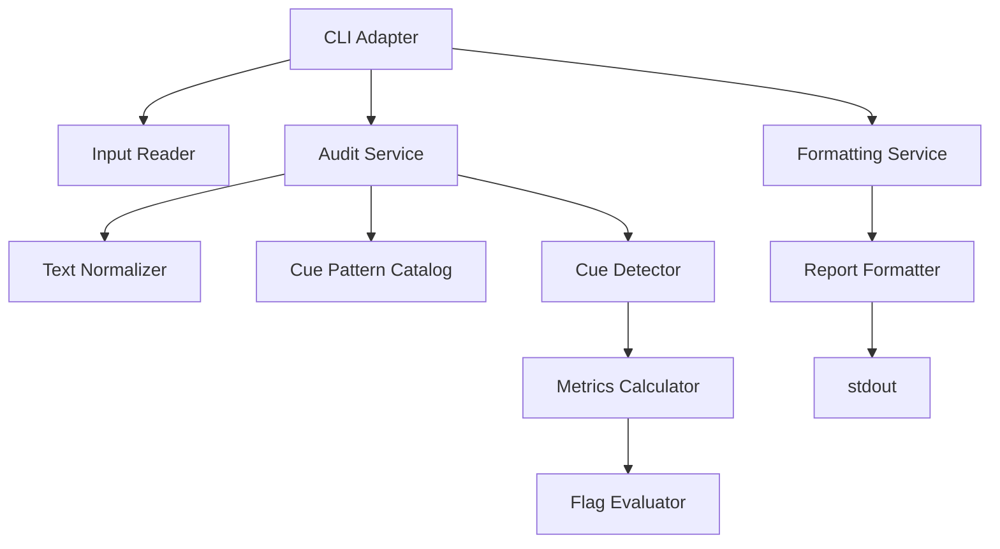

# Component Dependency

## Dependency Summary

CueLint uses a one-directional pipeline. Input and output adapters depend on the audit service, while the audit kernel components remain independent of CLI concerns.

## Dependency Matrix

| Component | Depends On | Dependency Type | Rationale |
|---|---|---|---|
| CLI Adapter | Input Reader, Audit Service, Formatting Service | Runtime | Orchestrates user-facing command execution. |
| Input Reader | None | None | Reads text from stdin or file only. |
| Audit Service | Text Normalizer, Cue Pattern Catalog, Cue Detector, Metrics Calculator, Flag Evaluator | Runtime | Coordinates deterministic audit pipeline. |
| Text Normalizer | None | None | Pure text transformation and segmentation. |
| Cue Pattern Catalog | None | None | Static inspectable pattern definitions. |
| Cue Detector | Text Normalizer outputs, Cue Pattern Catalog | Runtime | Matches patterns against normalized document. |
| Metrics Calculator | Text Normalizer outputs, Cue Detector outputs | Runtime | Computes transparent counts and densities. |
| Flag Evaluator | Metrics Calculator outputs | Runtime | Evaluates deterministic thresholds. |
| Formatting Service | Report Formatter | Runtime | Converts audit result to selected format. |
| Report Formatter | Audit Result structures | Runtime | Renders JSON or Markdown. |

## Data Flow Diagram



## Text Alternative

```text
CLI Adapter
  -> Input Reader
  -> Audit Service
       -> Text Normalizer
       -> Cue Pattern Catalog
       -> Cue Detector
       -> Metrics Calculator
       -> Flag Evaluator
  -> Formatting Service
       -> Report Formatter
       -> stdout
```

## Communication Patterns

- Function calls only.
- No network calls.
- No background workers.
- No database or file persistence beyond reading the requested input file.
- Stable structured values passed between components.

## Boundary Rules

- CLI Adapter may parse arguments and handle process exits; audit kernel components must not.
- Report Formatter may render results; it must not alter detection or metrics.
- Cue Detector may emit evidence; it must not evaluate semantic correctness or factuality.
- Flag Evaluator may emit threshold flags; it must not claim calibrated risk scores.

