# Execution Plan

## Detailed Analysis Summary

### Change Impact Assessment

- **User-facing changes**: Yes. A local CLI will be created for auditing LLM output text.
- **Structural changes**: Yes. The repository will receive a small Python project structure for the audit kernel and CLI.
- **Data model changes**: No persistent data model is required. The only structured outputs are evidence rows and summary metrics.
- **API changes**: No external service API is required. The CLI interface is the primary contract.
- **NFR impact**: Low. The key qualities are interpretability, maintainability, portability, and low-latency local execution.

### Risk Assessment

- **Risk Level**: Low
- **Rollback Complexity**: Easy
- **Testing Complexity**: Simple
- **Primary Risk**: Over-expanding scope into SDK packaging, multilingual support, dashboarding, or ML training before the deterministic core is complete.

## Workflow Visualization

### Mermaid Diagram

```mermaid
flowchart TD
    Start(["User Request"])

    subgraph INCEPTION["INCEPTION PHASE"]
        WD["Workspace Detection<br/><b>COMPLETED</b>"]
        RE["Reverse Engineering<br/><b>SKIP</b>"]
        RA["Requirements Analysis<br/><b>COMPLETED</b>"]
        US["User Stories<br/><b>SKIP</b>"]
        WP["Workflow Planning<br/><b>REVIEW</b>"]
        AD["Application Design<br/><b>SKIP</b>"]
        UG["Units Generation<br/><b>SKIP</b>"]
    end

    subgraph CONSTRUCTION["CONSTRUCTION PHASE"]
        FD["Functional Design<br/><b>SKIP</b>"]
        NFRA["NFR Requirements<br/><b>SKIP</b>"]
        NFRD["NFR Design<br/><b>SKIP</b>"]
        ID["Infrastructure Design<br/><b>SKIP</b>"]
        CG["Code Generation<br/><b>EXECUTE</b>"]
        BT["Build and Test<br/><b>EXECUTE</b>"]
    end

    subgraph OPERATIONS["OPERATIONS PHASE"]
        OPS["Operations<br/><b>PLACEHOLDER</b>"]
    end

    Start --> WD
    WD --> RE
    RE --> RA
    RA --> US
    US --> WP
    WP --> AD
    AD --> UG
    UG --> FD
    FD --> NFRA
    NFRA --> NFRD
    NFRD --> ID
    ID --> CG
    CG --> BT
    BT --> OPS
    OPS --> End(["Complete"])

    style WD fill:#4CAF50,stroke:#1B5E20,stroke-width:3px,color:#fff
    style RA fill:#4CAF50,stroke:#1B5E20,stroke-width:3px,color:#fff
    style WP fill:#FFA726,stroke:#E65100,stroke-width:3px,stroke-dasharray: 5 5,color:#000
    style CG fill:#FFA726,stroke:#E65100,stroke-width:3px,stroke-dasharray: 5 5,color:#000
    style BT fill:#FFA726,stroke:#E65100,stroke-width:3px,stroke-dasharray: 5 5,color:#000
    style RE fill:#BDBDBD,stroke:#424242,stroke-width:2px,stroke-dasharray: 5 5,color:#000
    style US fill:#BDBDBD,stroke:#424242,stroke-width:2px,stroke-dasharray: 5 5,color:#000
    style AD fill:#BDBDBD,stroke:#424242,stroke-width:2px,stroke-dasharray: 5 5,color:#000
    style UG fill:#BDBDBD,stroke:#424242,stroke-width:2px,stroke-dasharray: 5 5,color:#000
    style FD fill:#BDBDBD,stroke:#424242,stroke-width:2px,stroke-dasharray: 5 5,color:#000
    style NFRA fill:#BDBDBD,stroke:#424242,stroke-width:2px,stroke-dasharray: 5 5,color:#000
    style NFRD fill:#BDBDBD,stroke:#424242,stroke-width:2px,stroke-dasharray: 5 5,color:#000
    style ID fill:#BDBDBD,stroke:#424242,stroke-width:2px,stroke-dasharray: 5 5,color:#000
    style OPS fill:#BDBDBD,stroke:#424242,stroke-width:2px,stroke-dasharray: 5 5,color:#000
    style Start fill:#CE93D8,stroke:#6A1B9A,stroke-width:3px,color:#000
    style End fill:#CE93D8,stroke:#6A1B9A,stroke-width:3px,color:#000
    style INCEPTION fill:#BBDEFB,stroke:#1565C0,stroke-width:3px,color:#000
    style CONSTRUCTION fill:#C8E6C9,stroke:#2E7D32,stroke-width:3px,color:#000
    style OPERATIONS fill:#FFF59D,stroke:#F57F17,stroke-width:3px,color:#000
    linkStyle default stroke:#333,stroke-width:2px
```



### Text Alternative

```text
INCEPTION
- Workspace Detection: COMPLETED
- Reverse Engineering: SKIP
- Requirements Analysis: COMPLETED
- User Stories: SKIP
- Workflow Planning: REVIEW
- Application Design: SKIP
- Units Generation: SKIP

CONSTRUCTION
- Functional Design: SKIP
- NFR Requirements: SKIP
- NFR Design: SKIP
- Infrastructure Design: SKIP
- Code Generation: EXECUTE
- Build and Test: EXECUTE

OPERATIONS
- Operations: PLACEHOLDER
```

## Phases to Execute

### INCEPTION PHASE

- [x] Workspace Detection - COMPLETED
- [x] Reverse Engineering - SKIPPED
  - **Rationale**: Greenfield workspace with no existing application code.
- [x] Requirements Analysis - COMPLETED
- [x] User Stories - SKIPPED
  - **Rationale**: First version is a local technical tool with one primary usage mode and minimal scope.
- [ ] Workflow Planning - REVIEW
  - **Rationale**: Current stage; awaiting explicit approval.
- [x] Application Design - SKIP
  - **Rationale**: Component boundaries are small enough to define in the code generation plan.
- [x] Units Generation - SKIP
  - **Rationale**: A single implementation unit is sufficient.

### CONSTRUCTION PHASE

- [x] Functional Design - SKIP
  - **Rationale**: Business logic is simple deterministic matching and can be captured in the code generation plan.
- [x] NFR Requirements - SKIP
  - **Rationale**: Key NFRs are already minimal and captured in requirements.
- [x] NFR Design - SKIP
  - **Rationale**: No separate NFR patterns are needed for the prototype.
- [x] Infrastructure Design - SKIP
  - **Rationale**: No deployment or infrastructure work is required.
- [ ] Code Generation - EXECUTE
  - **Rationale**: Implementation plan, code, tests, and CLI behavior are required.
- [ ] Build and Test - EXECUTE
  - **Rationale**: Build, test, and verification instructions are required.

### OPERATIONS PHASE

- [ ] Operations - PLACEHOLDER
  - **Rationale**: Future deployment and monitoring workflows are out of scope.

## Package Change Sequence

Not applicable. This is a greenfield single-package implementation.

## Estimated Timeline

- **Total Stages Remaining After Approval**: 2
- **Stages to Execute**: Code Generation, Build and Test
- **Stages to Skip**: User Stories, Application Design, Units Generation, Functional Design, NFR Requirements, NFR Design, Infrastructure Design
- **Estimated Duration**: Short, suitable for a compact prototype iteration.

## Success Criteria

- **Primary Goal**: A Python CLI can audit English assistant response text and emit interpretable cue evidence.
- **Key Deliverables**:
  - Python project structure.
  - Deterministic cue detection kernel.
  - CLI accepting stdin or file input.
  - Evidence table output and summary metrics.
  - Focused tests for cue detection and output behavior.
- **Quality Gates**:
  - Requirements approved.
  - Execution plan approved.
  - Code generation plan approved before implementation.
  - Tests pass after implementation.
